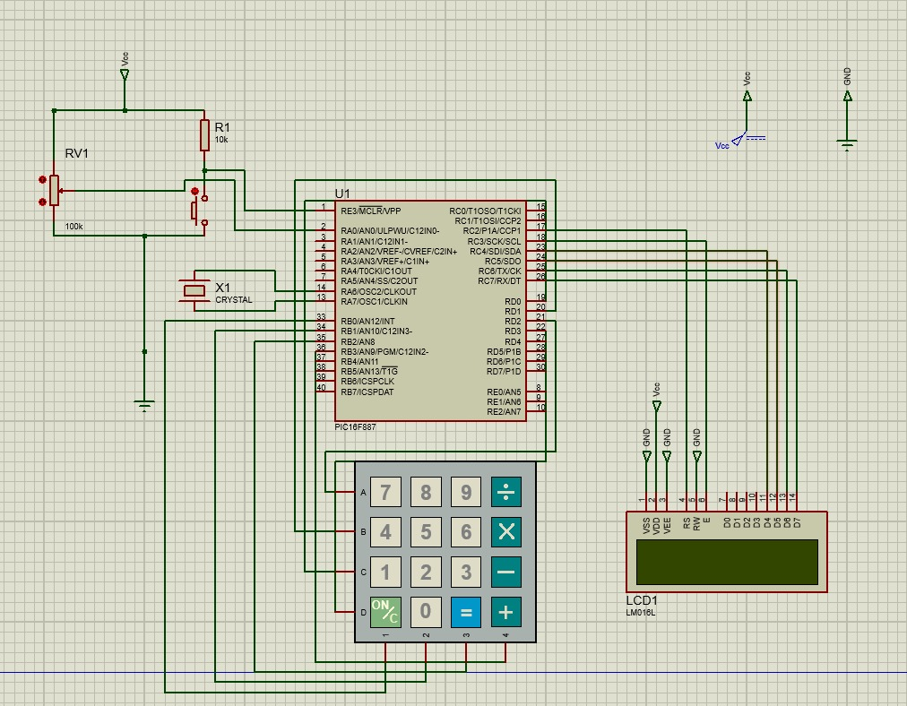
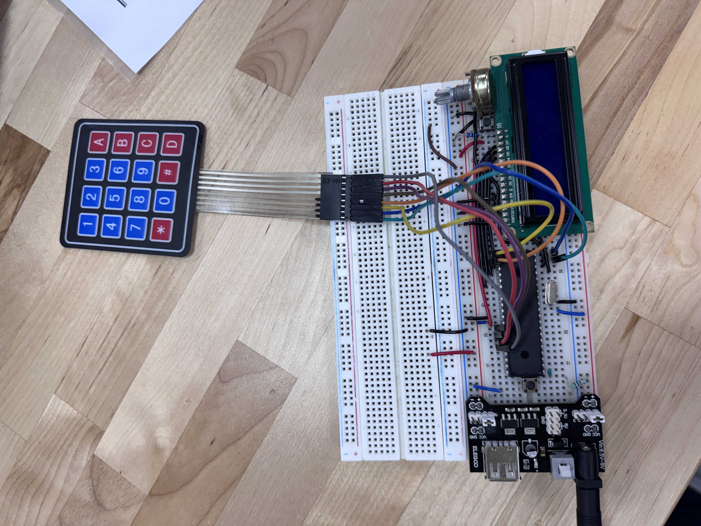

# Práctica 12

Esta práctica consistió en 2 actividades:
* Escribir en la LCD el carácter presionado en el teclado matricial.
* Realizar una calculadora básica que sume, reste, multiplique y divida dos números ingresados con el teclado matricial.

## Materiales utilizados
* PIC16F887
* Teclado matricial 4×4
* Pantalla LCD 16×2 (HD44780)
* Potenciómetro de 10kΩ (contraste LCD)
* Resistencia de 10kΩ (pull-down MCLR)
* Cristal oscilador de 8MHz

## Descripción

### Actividad 1: Escritura del carácter presionado en la LCD

Para poder realizar la actividad 1 se utilizó la siguiente lógica:

* **Mapa del teclado:** Se define la matriz `teclado[4][4]` con los caracteres asignados a cada posición del teclado matricial: dígitos `0`–`9`, letras `A`–`D`, `*` y `#`.

* **Función `LeerTecla()`:** Recorre las 4 filas del teclado de forma secuencial. En cada iteración pone en alto todas las filas con `PORTD |= 0x0F` y luego baja una sola fila (RD0–RD3). Después lee las 4 columnas (RB0–RB3); si alguna lee bajo, hay una tecla presionada. Se espera a que se suelte y se aplican 30 ms de antirrebote antes de devolver el carácter.

* **Configuración de puertos:** En `main()` se configura `TRISD = 0xF0` para que RD0–RD3 sean salidas (filas) y `TRISB = 0x0F` para que RB0–RB3 sean entradas (columnas). Se activan los pull-ups internos del PORTB con `OPTION_REGbits.nRBPU = 0` para que las columnas lean alto cuando no hay tecla presionada.

* **Visualización en LCD:** El carácter devuelto por `LeerTecla()` se envía directamente a `LCD_putc()`, mostrándolo en pantalla al instante.

* **Bucle principal:** El `while(1)` llama continuamente a `LeerTecla()`. Si el valor devuelto es distinto de `0`, lo escribe en la LCD.

### Actividad 2: Calculadora básica con teclado matricial

Para poder realizar la actividad 2 se utilizó la siguiente lógica:

* **Definiciones y variables:** Se define `_XTAL_FREQ` a 8 MHz. Se usan las cadenas `num1_str[16]` y `num2_str[16]` para acumular los dígitos ingresados, las variables `long` `num1`, `num2` y `resultado` para los valores escalados ×100, y las variables `operador`, `estado` y `mostrandoRes` para controlar el flujo de la calculadora.

* **Funciones auxiliares:** Se crean las funciones `LeerTecla()`, `convertirNumero()`, `mostrarResultado()` y `limpiarEstado()`. La primera escanea el teclado, la segunda convierte un string como `"12.35"` al entero escalado `1235`, la tercera formatea y muestra el resultado en LCD con `sprintf()`, y la última reinicia todas las variables para iniciar una nueva operación.

* **Configuración inicial:** En `main()` se inicializan los puertos y la LCD. Se deshabilitan todos los canales analógicos con `ANSEL = 0x00` y `ANSELH = 0x00`. La pantalla muestra un mensaje de bienvenida `"Calculadora / A+ B- C* D/"` durante 2 segundos.

* **Asignación de teclas:** Los dígitos `0`–`9` ingresan cifras al número actual; `#` inserta el punto decimal (máximo uno por número); `A`, `B`, `C` y `D` asignan el operador `+`, `−`, `×` y `÷` respectivamente; `*` calcula el resultado o limpia la pantalla si no hay nada ingresado.

* **Aritmética escalada ×100:** Para evitar el uso de punto flotante, los números se almacenan multiplicados por 100. La suma y resta son directas; la multiplicación divide el producto entre 100 para volver a la escala correcta; la división multiplica el numerador por 100 adicional antes de dividir para conservar los decimales. Si se divide entre cero se muestra `"Error: Div entre 0"` por 2 segundos.

* **Bucle principal:** El `while(1)` llama a `LeerTecla()` y procesa la tecla recibida. Tras cada pulsación válida refresca la fila 0 de la LCD mostrando `num1 + símbolo_operador + num2` en tiempo real.

## Simulación e Implementación

### Actividad 1

### Actividad 2

## Archivos

Para esta práctica se cuentan con los siguientes archivos:
* [Archivo del código en C](./Archivos%20C)
* [Archivo .hex generado por MPLAB](./Archivos%20.hex)
* [Archivo de la simulación de Proteus](./assets/Practica12.pdsprj)
