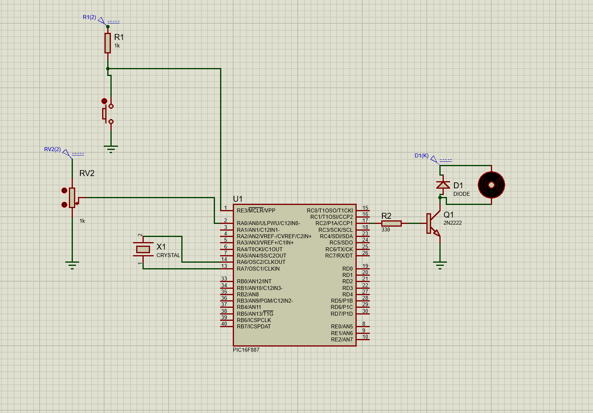
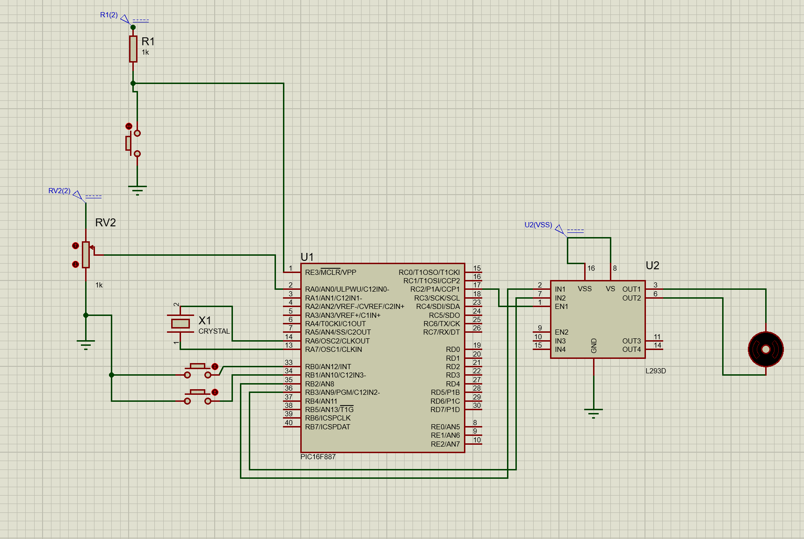
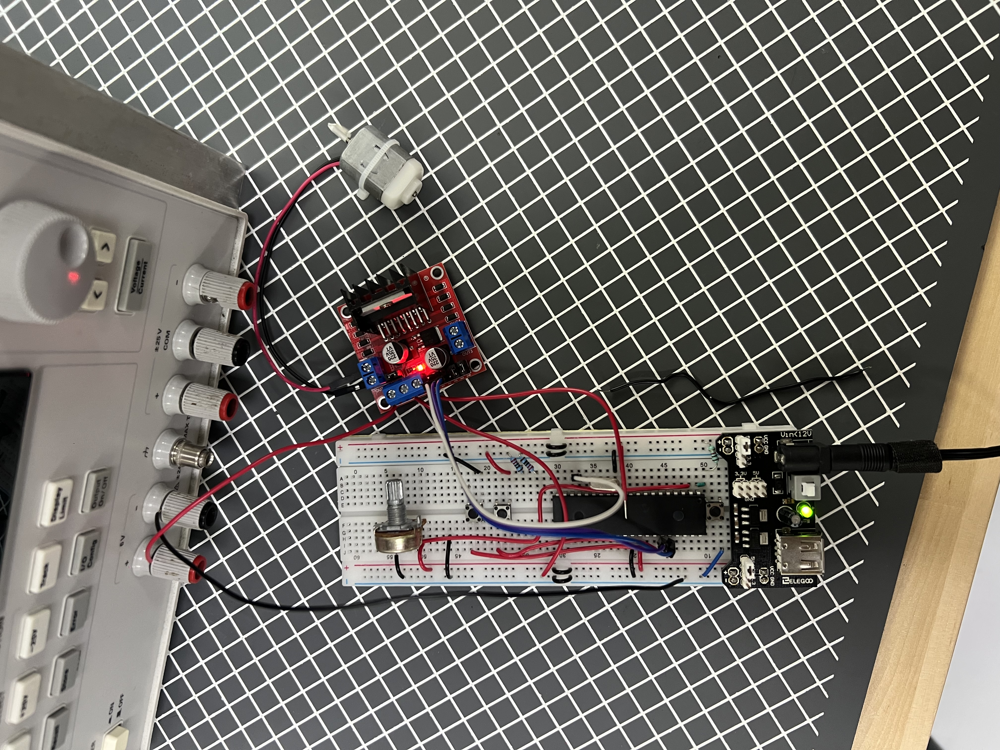

# Práctica 13

Esta práctica consistió en 2 ejercicios:
* Controlar la velocidad de un motor de corriente directa mediante un potenciómetro utilizando PWM por Hardware.
* Controlar la velocidad y el sentido de giro de un motor de corriente directa mediante PWM y dos botones.

## Materiales utilizados
* PIC16F887
* Driver L293D (Puente H)
* Motor DC
* 2 Push buttons
* Potenciómetro de 10kΩ
* Fuente de alimentación para el motor
* Cristal oscilador de 8MHz

## Descripción

### Ejercicio 1: Control de velocidad de un motor DC mediante PWM

Para poder realizar el ejercicio 1 se utilizó la siguiente lógica:

* Definiciones y Variables: Se define la constante `_XTAL_FREQ` con un valor de 8 MHz para utilizar correctamente las funciones de retardo. Se utiliza la variable `pot` para almacenar el valor leído por el convertidor analógico-digital.

* Funciones auxiliares: Se crean las funciones `ADC_Init()`, `ADC_Read()`, `PWM_Init()` y `PWM_SetDuty()`. La primera configura el convertidor analógico-digital, la segunda realiza la lectura del canal analógico seleccionado, la tercera inicializa el módulo PWM y la última actualiza el ciclo de trabajo de la señal PWM.

* Configuración inicial: En la función `main()` se inicializan el convertidor analógico-digital y el módulo PWM mediante las funciones `ADC_Init()` y `PWM_Init()`. El canal AN0 queda configurado como entrada analógica y el pin RC2 como salida del módulo CCP1.

* Configuración del ADC: Esta es la parte clave antes de entrar al bucle. En la función `ADC_Init()` se configura el canal AN0 como entrada analógica mediante `ANSEL = 0x01`, mientras que el resto de los pines permanecen configurados como digitales utilizando `ANSELH = 0x00`. También se configuran los registros `ADCON0` y `ADCON1` para habilitar el convertidor analógico-digital.

* Configuración del PWM: En la función `PWM_Init()` se configura el pin RC2 como salida del módulo CCP1. Se establece el período del PWM mediante el registro `PR2`, se configura el módulo CCP1 en modo PWM y finalmente se habilita el Timer2 para comenzar la generación de la señal PWM.

* Bucle Principal: Se entra en el `while(1)`. Aquí el programa realiza continuamente la lectura del potenciómetro mediante la función `ADC_Read(0);` y posteriormente envía ese valor a la función `PWM_SetDuty();`. Como resultado, el ciclo de trabajo del PWM cambia continuamente, modificando la velocidad de giro del motor DC.

### Ejercicio 2: Control de velocidad y dirección de un motor DC

Para poder realizar el ejercicio 2 se utilizó la siguiente lógica:

* Definiciones y Variables: Se define la constante `_XTAL_FREQ` con un valor de 8 MHz para utilizar correctamente las funciones de retardo. Se utiliza la variable `pot` para almacenar la lectura del potenciómetro y las variables `prev_RB0` y `prev_RB1` para detectar el flanco de bajada de los botones conectados al Puerto B.

* Funciones auxiliares: Se crean las funciones `ADC_Init()`, `ADC_Read()`, `PWM_Init()` y `PWM_SetDuty()`. Estas funciones permiten configurar el convertidor analógico-digital, obtener la lectura del potenciómetro, inicializar el módulo PWM y actualizar el ciclo de trabajo de la señal PWM.

* Configuración inicial: En la función `main()` se inicializan el convertidor analógico-digital y el módulo PWM. Además, se configuran los pines RB0 y RB1 como entradas para los botones de dirección, mientras que RB2 y RB3 se configuran como salidas para controlar las entradas del puente H. También se habilitan las resistencias Pull-up internas del Puerto B mediante `OPTION_REGbits.nRBPU = 0`.

* Configuración del ADC: Esta es la parte clave antes de entrar al bucle. Se configura el canal AN0 como entrada analógica para conectar el potenciómetro que controla la velocidad del motor, mientras que el resto de los pines permanecen configurados como digitales.

* Configuración del PWM: El módulo CCP1 se configura en modo PWM utilizando el pin RC2 como salida. El período se establece mediante el registro `PR2` y el Timer2 se utiliza para generar la señal PWM que controla la velocidad del motor.

* Bucle Principal: Se entra en el `while(1)`. Primero el programa realiza continuamente la lectura del potenciómetro mediante la función `ADC_Read(0);` y actualiza el ciclo de trabajo del PWM utilizando `PWM_SetDuty();`. Posteriormente monitorea los botones conectados a RB0 y RB1. Cuando detecta un flanco de bajada en RB0, activa la salida RB2 y desactiva RB3 para hacer girar el motor en un sentido. Si detecta un flanco de bajada en RB1, realiza la operación contraria activando RB3 y desactivando RB2, logrando invertir el sentido de giro del motor.

## Simulación e Implementación

### Ejercicio 1

### Ejercicio 2

## Archivos

Para esta práctica se cuentan con los siguentes archivos para todos los ejercicios:
* [Archivo del código en C](./Archivos%20C)
* [Archivo .hex generado por MPLAB](./Archivos%20.hex)
* [Archivo de la simulación de Proteus](./assets/Practica13.pdsprj)
