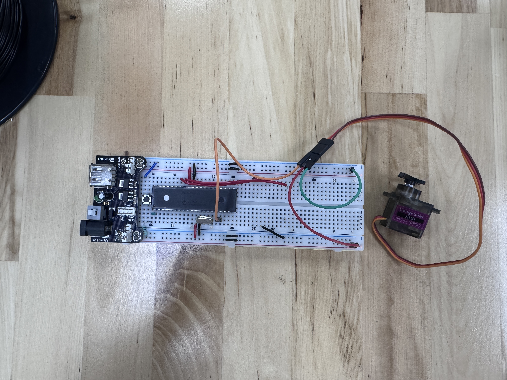

# Práctica 14: Servomotores

Esta práctica consistió en 2 ejercicios:
* Actividad 1: Controlar el ciclo de giro de un servomotor de 0° a 180° y de regreso
* Actividad 2: Utilizar un potenciómetro para controlar el ángulo de giro de un servomotor

## Materiales utilizados
* PIC16f887
* Servomotor
* Potenciómetro
* Resistencias de 220Ω
* Cristal oscilador de 8Mhz

## Descripción

### Actividad 1: Barrido automático de 0° a 180° y de regreso

Para esta actividad se utilizó la siguiente lógica:

* Configuración del módulo PWM (CCP1): Se configura el pin RC2 como salida (TRISC2 = 0) ya que es el pin físico asociado al módulo CCP1, encargado de generar la señal PWM. Se establece PR2 con el valor 249, lo cual junto con el prescaler de Timer2 configurado en T2CON (0b00000111, prescaler 1:16) genera un periodo de señal de 20ms, que es el estándar requerido por la mayoría de servomotores.

* Definición de límites del pulso: Se definen las constantes PULSO_MIN (500) y PULSO_MAX (1000), que en unidades del Timer2 (resolución de 4 cuentas) corresponden aproximadamente a un ancho de pulso de 1ms (0°) y 2ms (180°) respectivamente, que es el rango estándar de control de servomotores.

* Función Set_Pulso: Esta función recibe un valor de pulso de 10 bits y lo separa en los registros necesarios para configurar el duty cycle del PWM: los 2 bits menos significativos se escriben en los bits DC1B del registro CCP1CON, mientras que los 8 bits restantes se escriben en CCPR1L. Esta combinación de registros le da al módulo CCP1 la resolución necesaria para un control preciso del ancho de pulso.

* Barrido gradual del servo: En el bucle principal se recorre un ciclo for desde 0 hasta PASOS (100), calculando en cada iteración un valor de pulso interpolado linealmente entre PULSO_MIN y PULSO_MAX según el paso actual. Esto genera un movimiento gradual y suave del servo de 0° a 180°, esperando 50ms (TIEMPO_PASO_MS) entre cada paso para dar tiempo al servo de alcanzar la posición indicada.

* Movimiento de regreso: Inmediatamente después, se ejecuta un segundo ciclo for que recorre los pasos en sentido inverso (de PASOS a 0), regresando el servo de 180° a 0° con la misma interpolación gradual, completando así un ciclo continuo de ida y vuelta que se repite indefinidamente dentro del while(1).

### Actividad 2: Control del ángulo mediante potenciómetro

Para esta actividad se añadió la siguiente lógica:

* Configuración del Módulo ADC: Se configura ANSEL para declarar el pin del potenciómetro como entrada analógica, y se configura ADCON0/ADCON1 para seleccionar el reloj de conversión y el voltaje de referencia (Vdd/Vss).

* Lectura del potenciómetro: Se inicia la conversión activando el bit GO/DONE y se espera (sondeo) hasta que se limpia automáticamente. El valor de 10 bits resultante (ADRESH:ADRESL) representa la posición del potenciómetro entre 0 y 1023.

* Mapeo del valor del ADC al rango del servo: El valor leído del ADC se transforma proporcionalmente al rango de pulso del servo, multiplicando la diferencia entre PULSO_MAX y PULSO_MIN por el valor del ADC y dividiendo entre 1023, sumando finalmente PULSO_MIN como punto de partida. Esto permite que, al girar el potenciómetro de un extremo a otro, el servo se mueva proporcionalmente de 0° a 180°.

* Actualización continua: En el bucle principal se actualiza constantemente el valor del pulso enviado al servo (mediante Set_Pulso) según la posición actual del potenciómetro, logrando un control en tiempo real del ángulo del servomotor.

## Simulación e Implementación

## Archivos
Para esta práctica se cuentan con los siguientes archivos para todos los ejercicios:
* [Archivo del código en C](./Archivos%20C)
* [Archivo .hex generado por MPLAB](./Archivos%20.hex)
* [Archivo de la simulación de Proteus](./Practica14.pdsprj)
