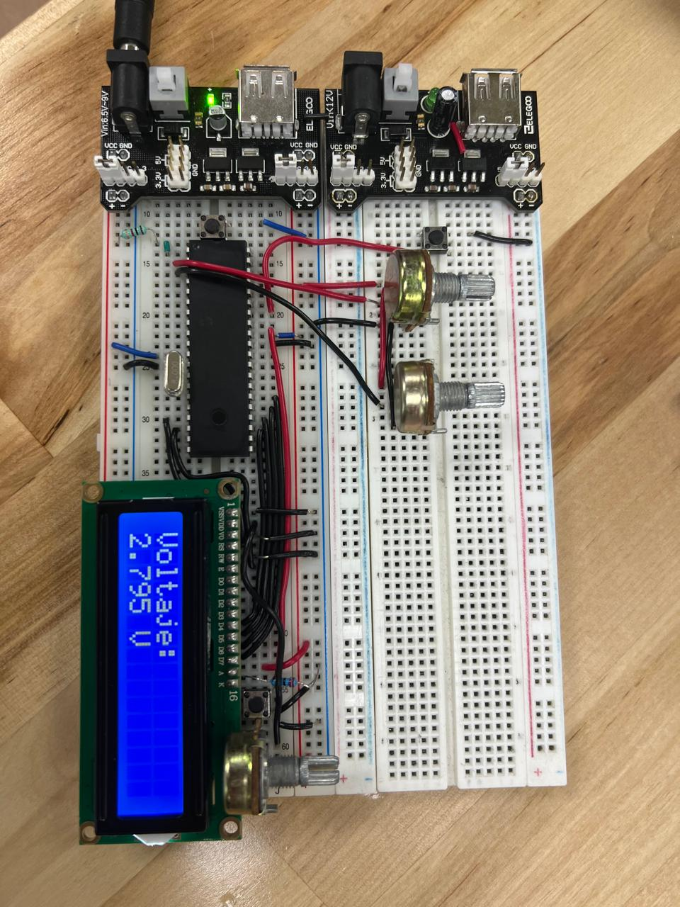

# Práctica 7

Esta práctica consistió en 2 ejercicios:
* Ejercicio 1: Mostrar en la LCD el valor del voltaje en un potenciometro
* Ejercicio 2: Añadir un push button para cambiar la vista en voltaje/ADC/porcentaje

## Materiales utilizados
* PIC16f887
* Push button
* Pantalla LCD 16x2
* Potenciometro
* Cristal oscilador de 8Mhz

## Descripción

### Ejercicio 1: Mostrar voltaje del pot en la LCD

Para poder realizar este ejercicio se dividió el código en la inicialización del ADC, su lectura y el procesamiento matemático de los datos:

1. Inicialización del ADC (`ADC_Init()`):

* Configuración del pin analógico: Se utiliza ANSEL = 0x01; para decirle al microcontrolador que el pin RA0 (canal AN0) funcionará como entrada analógica, mientras que ANSELH = 0x00; deja los demás pines como digitales.

* Registro de Control 0 (ADCON0 = 0x81;): Este valor hexadecimal (que en binario es 10000001) configura varias cosas: selecciona el reloj de conversión adecuado, elige el canal 0 (donde está tu potenciómetro) y enciende el módulo ADC (poniendo el bit 0 en 1).

* Registro de Control 1 (ADCON1 = 0x80;): Este valor (10000000 en binario) le indica al microcontrolador que el resultado de la lectura (que es de 10 bits) se "justifique a la derecha" dentro de los registros y que los voltajes de referencia serán los mismos de la alimentación (0V a 5V).

2. Rutina de Lectura (`ADC_Read()`):

* Tiempo de adquisición: Se aplica un pequeño retardo de __delay_us(5); para darle tiempo al capacitor interno del microcontrolador a que se cargue con el voltaje exacto del potenciómetro antes de medirlo.

* Inicio de conversión: Se enciende la bandera GO_nDONE = 1; para que el ADC comience a procesar el voltaje analógico y lo convierta a digital.

* Espera activa: El ciclo vacío while(GO_nDONE); mantiene al microcontrolador esperando. El hardware interno pondrá esta bandera en 0 automáticamente cuando termine de convertir.

* Unión de registros: Como el resultado es de 10 bits (un número del 0 al 1023), no cabe en un solo registro de 8 bits. Por lo tanto, se recorre el registro alto 8 espacios a la izquierda (ADRESH << 8) y se le suma el registro bajo (ADRESL), devolviendo el número entero completo.

3. Bucle Principal y Matemáticas (main):

* Se obtienen los datos crudos llamando a unsigned int adc_value = ADC_Read();. Esto nos entrega un valor entre 0 (0V) y 1023 (5V).

* Conversión a Milivoltios: En lugar de usar números decimales (flotantes), los cuales consumen muchísima memoria en un microcontrolador de 8 bits, se utiliza una técnica matemática avanzada trabajando solo con enteros. Se multiplica el valor leído por el voltaje máximo (5000 milivoltios). Nota: El sufijo UL (Unsigned Long) se añade para evitar que la multiplicación desborde el límite de memoria antes de dividirse entre 1023.

* Separación de Enteros y Decimales: * Al dividir los milivoltios entre 1000 (entera = milivoltios / 1000;), obtenemos el número entero de voltios (ej. si son 2500 mV, esto da 2).

* Al usar la operación módulo (decimal = milivoltios % 1000;), nos quedamos con el residuo, que representa los decimales exactos (ej. el residuo de 2500 / 1000 es 500).

* Formateo del Texto: Se utiliza la función sprintf de la librería <stdio.h> para armar la oración final en la variable buffer. Se usa %u para el voltio entero, y %03u para asegurar que los decimales siempre impriman 3 dígitos (incluso si son ceros, para que diga "2.050 V" y no "2.5 V").

* Finalmente, se manda la primera palabra a la primera línea del display, y la variable buffer ya ensamblada a la segunda línea.

### Ejercicio 2: Cambio de vista a voltaje/ADC/porcentaje

  
Para poder realizar este ejercicio se implementó una máquina de estados controlada por un botón físico, utilizando la siguiente lógica:

* Variables de Estado: Antes del bucle principal, se declaran dos variables clave. modo inicia en 0 y servirá para recordar en qué "pantalla" estamos. `boton_anterior` inicia en 1 y funcionará como una memoria para saber si el botón ya estaba presionado en el ciclo anterior.

* Detección de Flanco: En lugar de preguntar simplemente "está el botón presionado", la condición `if(!PORTBbits.RB0 && boton_anterior)` pregunta: "¿El botón está presionado AHORA y estaba suelto ANTES?". Esto garantiza que la acción se ejecute exactamente en el instante en que el dedo baja el botón, evitando registrar múltiples pulsaciones accidentales.

* Anti-rebote y Bloqueo: Al detectar el toque, se hace una pausa de 20 ms (__delay_ms(20);) para ignorar el ruido metálico inicial del botón.

  * Se incrementa la variable modo (sumando 1). Si supera el valor de 2, se reinicia a 0, creando un ciclo continuo (0 -> 1 -> 2 -> 0...).

  * El bucle vacío `while(!PORTBbits.RB0);` atrapa al programa hasta que el usuario levante el dedo, seguido de otra pausa de 20 ms para estabilizar la señal.

Actualización del Estado Anterior: Antes de continuar, se actualiza la "memoria" del botón (boton_anterior = PORTBbits.RB0;) para estar listos para el próximo ciclo.

* Máquina de Estados (Estructura Switch): Tras leer el valor del ADC, se evalúa la variable modo mediante un bloque switch(modo). Dependiendo de su valor, el programa entra a un "estuche" (case) diferente para realizar las matemáticas correspondientes:

  * Case 0 (Modo Voltaje): Ejecuta la misma lógica del ejercicio anterior. Convierte el valor bruto a milivoltios multiplicando por 5000 y dividiendo entre 1023. Separa enteros de decimales para imprimir un formato amigable como "2.500 V".

  * Case 1 (Modo ADC): Es la vista "cruda" para el desarrollador. Toma la variable adc_value directamente y la imprime en pantalla. Mostrará un número entero entre 0 y 1023.

  * Case 2 (Modo Porcentaje): Escala el valor a un formato del 0% al 100%. Se logra multiplicando el valor crudo por 100 y dividiendo entre el máximo teórico (1023). Se imprime con el símbolo %% (en la función sprintf, poner doble porcentaje sirve para imprimir el símbolo % literal en la pantalla).

* Tasa de Refresco: Al final del bucle, se incluye un retardo general de __delay_ms(80);. Esto permite que la pantalla LCD se actualice a una velocidad agradable para el ojo humano, evitando que los números parpadeen bruscamente si el potenciómetro se mueve rápido.

## Implementación

## Archivos
Para esta práctica se cuentan con los siguentes archivos para todos los ejercicios:
* [Archivo del código en C](./Archivos%20C)
* [Archivo .hex generado por MPLAB](./Archivos%20.hex)
* [Archivo de la simulación de Proteus](./Practica3_1.pdsprj) 
